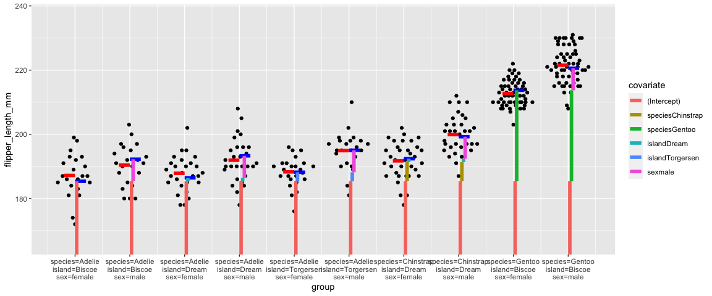
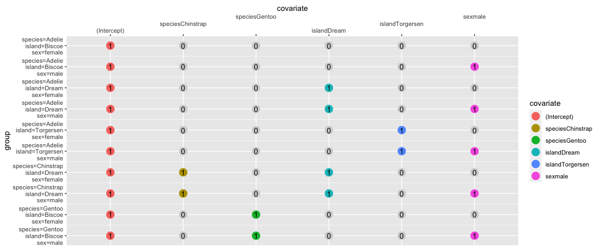
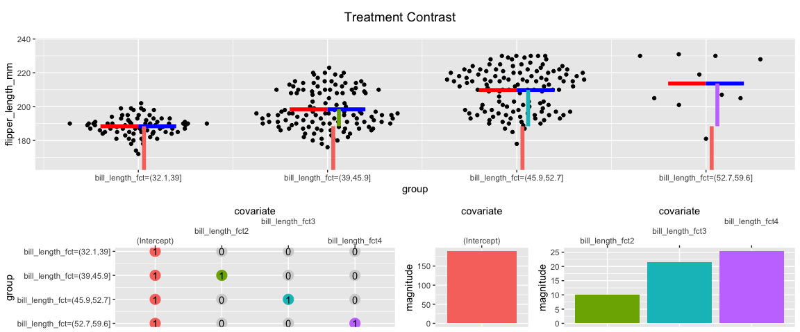
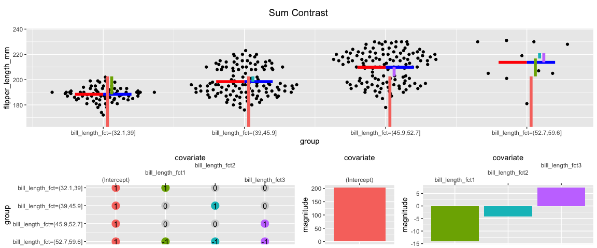
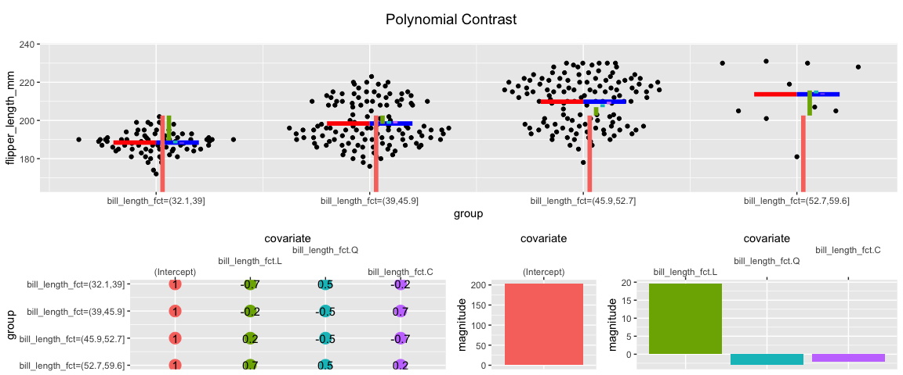
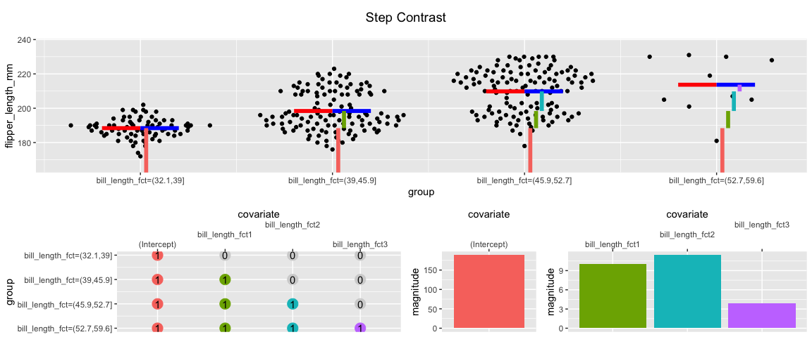
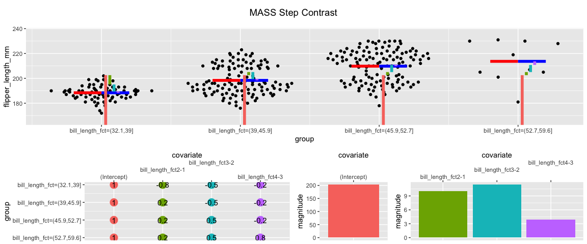

<!-- README.md is generated from README.Rmd. Please edit that file -->

# CoefExplainer

<!-- badges: start -->
<!-- badges: end -->

Understand How to Interpret the Coefficients of a Categorical Linear
Model

## Installation

You can install the released version of CoefExplainer from
[Github](https://CRAN.R-project.org) with:

``` r
devtools::install_github("const-ae/CoefExplainer")
```

## Example

Let’s demonstrate the package with the `palmerpenguins` package. First,
we have to remove all `NA`’s.

``` r
peng <- palmerpenguins::penguins
# Remove any NA's
peng <- peng[! apply(peng, 1, function(row) any(is.na(row))), ]
peng
#> # A tibble: 333 × 8
#>    species island    bill_length_mm bill_depth_mm flipper_length_mm body_mass_g
#>    <fct>   <fct>              <dbl>         <dbl>             <int>       <int>
#>  1 Adelie  Torgersen           39.1          18.7               181        3750
#>  2 Adelie  Torgersen           39.5          17.4               186        3800
#>  3 Adelie  Torgersen           40.3          18                 195        3250
#>  4 Adelie  Torgersen           36.7          19.3               193        3450
#>  5 Adelie  Torgersen           39.3          20.6               190        3650
#>  6 Adelie  Torgersen           38.9          17.8               181        3625
#>  7 Adelie  Torgersen           39.2          19.6               195        4675
#>  8 Adelie  Torgersen           41.1          17.6               182        3200
#>  9 Adelie  Torgersen           38.6          21.2               191        3800
#> 10 Adelie  Torgersen           34.6          21.1               198        4400
#> # … with 323 more rows, and 2 more variables: sex <fct>, year <int>
```

We can now load the `CoefExplainer` package and parse a formula for a
linear model with categorical covariates:

``` r
library(CoefExplainer)
coefExplFit <- CoefExplainer(peng, flipper_length_mm ~ species + island + sex)
```

There are three different ways to look at the model:

1.  A beeswarm plot for each group (black dots). For each group it shows
    how the coefficients are combined to arrive at the prediction for
    that group (blue line) and how that line compares against the true
    group mean (red line).

``` r
plotModel(coefExplFit)
```



2.  We can also look at the underlying model matrix

``` r
plotModelMatrix(coefExplFit)
```



3.  And lastly, we can look at the magnitude of each coefficient.

``` r
plotCoef(coefExplFit)
```


# Advanced Example

What happens if we deal with an ordered factor?

``` r
peng2 <- peng
peng2$bill_length_fct <- cut(peng2$bill_length_mm, breaks = 4, ordered_result = TRUE)

plotAll(CoefExplainer(peng2, flipper_length_mm ~ bill_length_fct))
```


We can use the `C()` function to change the contrast setting for the
`bill_length_fct`. Note how the predictions (blue lines) don’t change,
however the coefficients have very different interpretations depending
on the contrast setting. Do you recognize which is the default contrast
for an ordered factor?

``` r
peng2$bill_length_fct <- C(peng2$bill_length_fct, contr.treatment)
plotAll(CoefExplainer(peng2, flipper_length_mm ~ bill_length_fct), title = "Treatment Contrast")
```



``` r
peng2$bill_length_fct <- C(peng2$bill_length_fct, contr.sum)
plotAll(CoefExplainer(peng2, flipper_length_mm ~ bill_length_fct), title = "Sum Contrast")
```



``` r
peng2$bill_length_fct <- C(peng2$bill_length_fct, contr.poly)
plotAll(CoefExplainer(peng2, flipper_length_mm ~ bill_length_fct), title = "Polynomial Contrast")
```



``` r
peng2$bill_length_fct <- C(peng2$bill_length_fct, contr.helmert)
plotAll(CoefExplainer(peng2, flipper_length_mm ~ bill_length_fct), title = "Helmert Contrast")
```


I find all the coefficients above difficult to interpret. In my opinion,
for ordered factors a better choice is `contr.step()`:

``` r
contr.step <- function(n){
  ret <- matrix(0, nrow = n, ncol = n - 1)
  ret[lower.tri(ret)] <- 1
  ret
}

peng2$bill_length_fct <- C(peng2$bill_length_fct, contr.step)
plotAll(CoefExplainer(peng2, flipper_length_mm ~ bill_length_fct), title = "Step Contrast")
```



The MASS package provides a similar function called `contr.sdif()` that
produces coefficients that have the same values as the ones from the
`contr.step()` function. The only difference is the intercept. In the
`contr.step()`, the intercept corresponds to the mean of the first
group, whereas in the `contr.sdif()` function it is the mean over all
group means.

``` r
peng2$bill_length_fct <- C(peng2$bill_length_fct, MASS::contr.sdif)
plotAll(CoefExplainer(peng2, flipper_length_mm ~ bill_length_fct), title = "MASS Step Contrast")
```



# Credit

If you find the package useful, also checkout the
<http://www.bioconductor.org/packages/ExploreModelMatrix/> by Charlotte
Soneson et al. 
